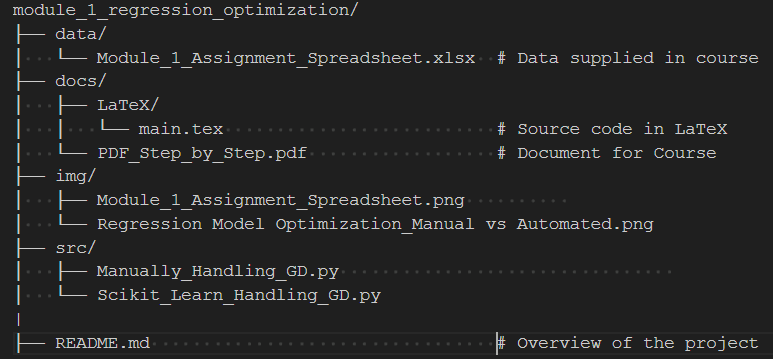

# Module 1: Regression Optimization
This repository contains all the files and documentation related to a class project where we explored different approaches to linear regression optimization. The main focus was comparing manual gradient descent fitting with automatic fitting using Python's scikit-learn library. Additionally, a detailed paper was written to outline the step-by-step process of building and optimizing a linear regression model using gradient descent.

## Project Overview
### 1. Data Source
The dataset used in this project was provided as part of the course. The main task was to use this data to compare the manual fitting of a regression line to the automatic fitting provided by modern libraries.

## Data File Location: 
data/Module_1_Assignment_Spreadsheet.xlsx
### 2. Manual vs Automatic Fitting
The first objective was to manually optimize a linear regression model using gradient descent. The goal was to gain an in-depth understanding of how the optimization process works by implementing it from scratch.
After manually stepping through the optimization process, I abstracted away the complexity by utilizing the scikit-learn library to fit the same model automatically.
### 3. Step-by-Step Paper
A detailed paper was written to document the linear regression model fitting process, including the theory and the application of gradient descent optimization. This document provides an extensive guide on how the optimization was performed manually and the results obtained.

## Paper:
docs/LaTeX/main.tex - The source LaTeX file for the written paper.
docs/PDF_Step_by_Step.pdf - The compiled PDF version of the step-by-step guide.
### 4. Code Implementation
I implemented the theory in code by writing two Python scripts to demonstrate the different approaches:

## Manual Fitting:
**src/Manually_Handling_GD.py**: This Python script contains the manual implementation of linear regression using gradient descent. The script steps through each iteration of the optimization process, allowing for a better understanding of how the parameters are adjusted to minimize the cost function.
##Automatic Fitting:
**src/Scikit_Learn_Handling_GD.py**: This Python script leverages the scikit-learn library to perform linear regression automatically. Using scikit-learn significantly reduced the amount of code required, enhancing the project's maintainability and readability.

# Project Structure


# How to Use this Repository
## 1. Clone the repository:

```bash
git clone https://github.com/sassom2112/module_1_regression_optimization.git
```

## 2.Set up the environment: Install the required dependencies using Conda by running:

```bash
conda env create -f environment.yml
```
**Alternatively**, install the required Python packages using pip:

```bash
pip install -r requirements.txt
```
## 3. Run the code:
### For manual gradient descent optimization:
```bash
python src/Manually_Handling_GD.py
```
### For scikit-learn's automatic fitting:
```bash
python src/Scikit_Learn_Handling_GD.py
```

### 4. View the paper:
You can find the step-by-step math behind usintg linear regressions in the docs folder as a PDF file (PDF_Step_by_Step.pdf) or as a LaTeX file (main.tex).
