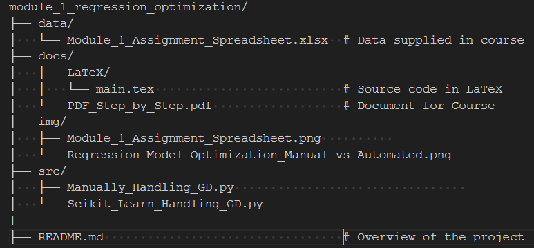
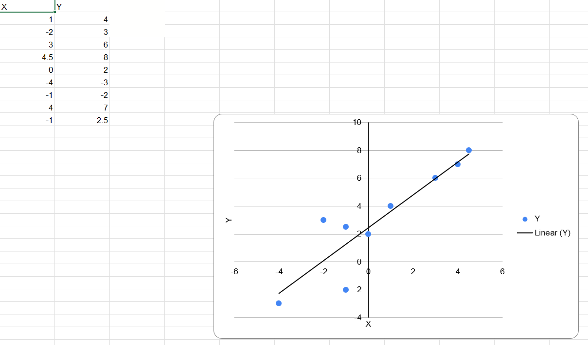
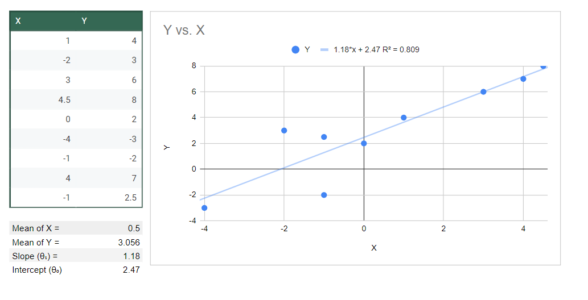

# Module 1: Regression Optimization

This repository compares manual linear regression training with gradient descent against automatic fitting using scikit-learn. It includes a manual implementation, a library-backed implementation, and a paper documenting the model optimization process.

## Project overview

- Data file: `data/Module_1_Assignment_Spreadsheet.xlsx`
- Manual gradient descent: `src/Manually_Handling_GD.py`
- Automatic fitting with scikit-learn: `src/Scikit_Learn_Handling_GD.py`
- Paper source: `docs/LaTeX/main.tex`
- Paper PDF: `docs/PDF_Step_by_Step.pdf`

## What this repo demonstrates

- Manual optimization of a linear regression model using gradient descent
- Comparison of custom training vs. scikit-learn's `LinearRegression`
- Visualizing the regression line and convergence behavior
- Measuring fit quality with standard metrics

## Requirements

This project requires:

- Python 3.10+ or a modern Conda environment
- `numpy`
- `pandas`
- `matplotlib`
- `scikit-learn`
- `openpyxl`

## Setup

### Option 1: Conda

```bash
conda env create -f environment.yml
conda activate gradient-descent-gd
```

### Option 2: pip

```bash
python -m venv .venv
source .venv/bin/activate
pip install -r requirements.txt
```

## Running the examples

### Manual gradient descent

```bash
python src/Manually_Handling_GD.py
```

### scikit-learn linear regression

```bash
python src/Scikit_Learn_Handling_GD.py
```

## Notes

- The manual implementation is intentionally verbose to show the gradient descent update and cost calculation.
- The scikit-learn script demonstrates the same regression problem with a tested library implementation and evaluation metrics.
- If the dataset path changes, update `file_path` inside the scripts or pass a path from the command line.

## Visuals






